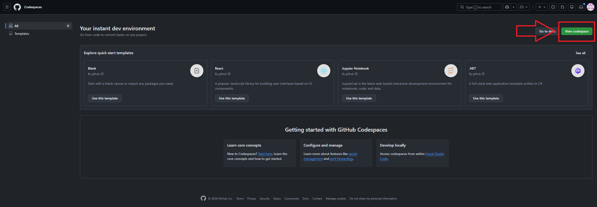
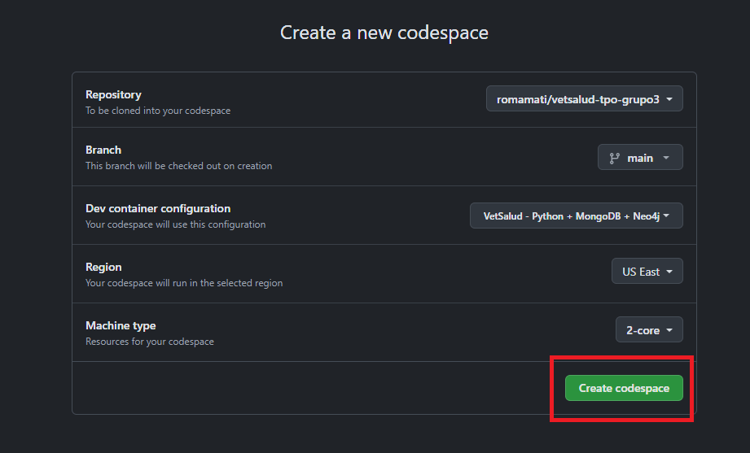

# VetSalud S.A. — Sistema de Gestión de Clínica Veterinaria

**Trabajo Práctico Obligatorio — Bases de Datos II | 1er Cuatrimestre 2026**

| Campo | Detalle |
|---|---|
| Grupo | 3 |
| Integrantes | Franco Ghigliani, Román Berruti, Matías Romanato |
| Materia | Bases de Datos II |

---

## Arquitectura de Persistencia Políglota

Este sistema implementa una arquitectura **políglota** combinando dos motores NoSQL de paradigmas distintos:

| Motor | Paradigma | Entidades | Justificación |
|---|---|---|---|
| **MongoDB** | Documental | Stock farmacéutico | Documentos con atributos variables, operaciones de inventario, actualizaciones masivas |
| **Neo4j** | Grafos | Pacientes, Propietarios, Veterinarios, Consultas, Vacunaciones | Relaciones complejas entre entidades, traversal eficiente, consultas de tipo JOIN profundo |

### ¿Por qué Neo4j y no una BD relacional?
Las entidades del sistema forman una red natural de relaciones: un paciente pertenece a un propietario, es atendido por veterinarios, recibe vacunas administradas por veterinarios, entre otras. Consultas como *"historial completo de un paciente"* o *"todos los pacientes de una sucursal a través del veterinario"* son travesías de grafo que Neo4j resuelve de forma nativa y eficiente mediante Cypher, evitando múltiples JOINs costosos.

### ¿Por qué MongoDB para el stock?
El inventario farmacéutico tiene atributos que pueden variar por categoría de producto, es independiente del grafo de relaciones clínicas, y requiere operaciones de actualización masiva (ej: decrementar unidades tras una consulta). El modelo documental de MongoDB es ideal para este caso.

---

## Tecnologías utilizadas

- **Python 3.12+**
- **pymongo** — driver oficial de MongoDB para Python
- **neo4j** — driver oficial de Neo4j para Python
- **pandas** — carga y procesamiento de CSVs
- **python-dotenv** — manejo de variables de entorno

---
## Ejecución en GitHub Codespaces
### 1. Crear un nuevo Codespace basado en la rama `main` del repositorio
1. En https://github.com/codespaces seleccionar `New Codespace`

2. Seleccionar el repositorio en la branch `main` y crear el codespace


### 2. Cargar los datos iniciales y ejecutar el sistema
```bash
./run.sh
```

## Instalación, configuración y ejecución local

### 1. Clonar el repositorio y dirigirse al directorio donde el mismo se guardó

```bash
git clone https://github.com/romamati/vetsalud-tpo-grupo3.git
cd vetsalud-tpo-grupo3
```

### 2. Instalar dependencias

```bash
pip install -r requirements.txt
```

### 3. Levantar las bases de datos

**MongoDB** — debe estar corriendo localmente en el puerto 27017.
Si tenés MongoDB Community instalado, simplemente abrí MongoDB Compass o iniciá el servicio.

**Neo4j** — se levanta con Docker:

```bash
docker run --name Myneo4j -p 7474:7474 -p 7687:7687 --env=NEO4J_AUTH=none -d neo4j
```

Para iniciar el contenedor si ya existe:
```bash
docker start Myneo4j
```

Podés verificar la interfaz web de Neo4j en: `http://localhost:7474`

### 4. Configurar variables de entorno

Crear un archivo `.env` en la raíz del proyecto basándose en `.env.example`:

```bash
cp .env.example .env
```

El archivo `.env` debe quedar así:

```
MONGO_URI=mongodb://localhost:27017/
MONGO_DB=vetsalud

NEO4J_URI=bolt://localhost:7687
NEO4J_USER=neo4j
NEO4J_PASSWORD=tu_password
```

> **Nota:** Si se usó el comando Docker con `NEO4J_AUTH=none`, el campo `NEO4J_PASSWORD` se deja vacío.

### 5. Cargar los datos iniciales y ejecutar el sistema

```bash
./run.sh
```

> **Nota:** Si el archivo no posee privilegios de ejecución, se debe ejecutar en una terminal bash: 
>``` bash
> chmod +x scripts/load_all.sh
>```
> y
> ``` bash
> chmod +x run.sh
> ```
> <br>


---

## Estructura del proyecto

```
vetsalud-tpo-grupo3/
├── .devcontainer/               # Archivos de configuración de container de docker
│   ├── devcontainer.json
│   └── Dockerfile
├── data/                        # CSVs con datasets provistos + 10 registros adicionales propios
│   ├── pacientes.csv
│   ├── propietarios.csv
│   ├── veterinarios.csv
│   ├── consultas.csv
│   ├── vacunaciones.csv
│   └── stock_farmaceutico.csv
├── mongodb_db/                  # Módulo MongoDB
│   ├── __init__.py
│   ├── connection.py            # Conexión a MongoDB
│   └── load_data.py             # Carga del stock farmacéutico desde CSV
├── neo4j_db/                    # Módulo Neo4j
│   ├── __init__.py
│   ├── connection.py            # Conexión a Neo4j
│   └── load_data.py             # Carga de nodos y relaciones desde CSV
├── queries/
│   ├── __init__.py
│   ├── mongodb_queries.py       # Consultas Q8, Q15
│   └── neo4j_queries.py         # Consultas Q1–Q7, Q9, Q10, Q11, Q12–Q14
├── readme_resources/            # Imágenes utilizadas en este archivo
│   ├── codespace1.png
│   └── codespace2.png      
├── scripts/
│   └── load_all.sh
├── main.py                      # Menú principal integrador
├── requirements.txt
├── .env.example
├── .env.codespaces
├── docker-compose.yml
├── .gitignore
├── run.sh                       # Script central con carga de base de datos y ejecución del programa
└── README.md
```

---

## Consultas implementadas

| # | Descripción | Motor |
|---|---|---|
| 1 | Pacientes activos con todos sus datos de propietario | Neo4j |
| 2 | Consultas médicas en estado 'Seguimiento' con veterinario y costo | Neo4j |
| 3 | Historial completo de un paciente (consultas + vacunas por fecha) | Neo4j |
| 4 | Propietarios con más de un paciente registrado | Neo4j |
| 5 | Veterinarios activos y cantidad de consultas en los últimos 60 días | Neo4j |
| 6 | Pacientes con vacunas vencidas | Neo4j |
| 7 | Top 5 diagnósticos más frecuentes | Neo4j |
| 8 | Stock con menos de 50 unidades y su proveedor | MongoDB |
| 9 | Consultas de tipo 'Control' con costo menor a $5.000 | Neo4j |
| 10 | Todos los pacientes de una sucursal determinada | Neo4j |
| 11 | Ingresos totales por veterinario en el mes actual | Neo4j |
| 12 | Propietarios sin consultas en el último año | Neo4j |
| 13 | ABM completo de propietarios | Neo4j |
| 14 | Registro de nueva consulta médica con validación | Neo4j |
| 15 | Actualización masiva del stock tras una consulta | MongoDB |
